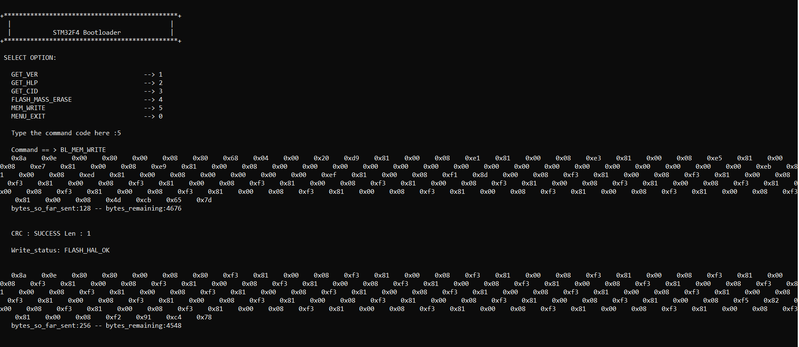

# Project-Bootloader

Implemented custom bootloader to perform In Application Programming (IAP). 
Bootloader can write a user application binary to particular sector of Flash.
It can perform sector erase as well as mass erase the user flash.
The Host application was designed in Python using Pyserial library . 
STM32-F446RE Nucleo Board would communicate with the Host over virtual com port.Bootloader and User Application were created using 
ST's CubeMX generated APIs.

Writing User-Application Binary into Flash Sector:

